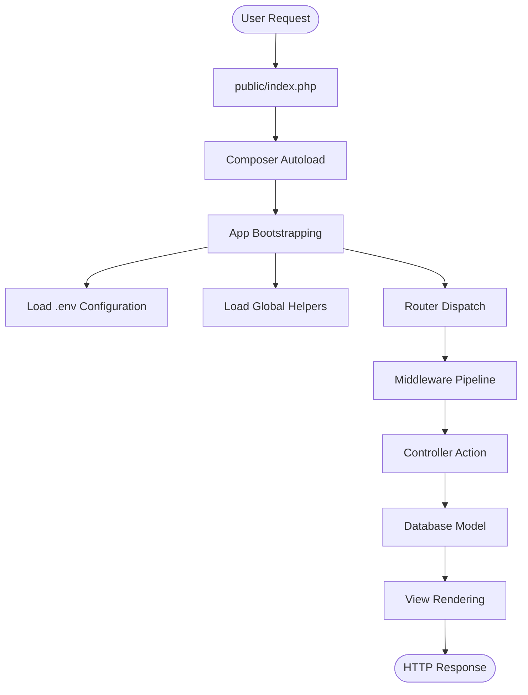

# 🏗️ Arsitektur Aplikasi (Deep Dive)

The Framework dibangun dengan prinsip **Clean Code**, **Performance-Oriented**, dan **Security-First**. Dokumen ini menjelaskan bagaimana komponen-komponen framework berinteraksi satu sama lain secara mendalam.

## 1. Request Lifecycle (Siklus Hidup Permintaan)

Ini adalah alur perjalanan sebuah HTTP Request dari browser hingga menjadi Response.

### Penjelasan Detail Tiap Tahap:

#### A. Entry Point (`index.php`)

Semua request diarahkan oleh server (Apache/.htaccess) ke `public/index.php`. File ini bertugas:

1.  Memulai sesi PHP (`session_start` via helper).
2.  Memuat `vendor/autoload.php` untuk manajemen dependensi.
3.  Mendefinisikan konstanta global seperti `BASE_PATH`.

#### B. Bootstrapping (Core Initialization)

Di tahap ini, framework menyiapkan lingkungan kerjanya:

- **Environment**: Membaca file `.env` menggunakan `Dotenv\Dotenv`.
- **Error Handling**: Mengatur `set_error_handler` dan `set_exception_handler` untuk menangkap crash.
- **Routing**: Membaca file `routes/web.php` dan `routes/system.php` untuk memetakan URL ke fungsi.

#### C. Routing & Dispatching

Router (`TheFramework\App\Router`) tidak hanya mencocokkan string URL, tapi juga:

1.  **RegEx Parsing**: Mengubah parameter seperti `{id}` menjadi regex `(?P<id>[^/]+)`.
2.  **Method Matching**: Memastikan request GET tidak masuk ke route POST.
3.  **Reflection**: Mengambil parameter dari URL dan menyuntikkannya ke method Controller.

#### D. Middleware Pipeline

Sebelum masuk Controller, request harus melewati lapisan keamanan yang disebut Middleware (`app/Middleware/`).

1.  **Security Middleware**: `CsrfMiddleware` (Cek token form), `WafMiddleware` (Anti-SQL Injection/XSS).
2.  **Auth Middleware**: Memastikan user sudah login sebelum mengakses halaman dashboard.

---

## 2. Struktur Inti (Core Components)

The Framework dibangun di atas komponen-komponen statis yang efisien (Singleton Pattern).

### Application Container (`App`)

Class utama yang mengatur konfigurasi global.

- Lokasi: `app/Core/App.php` (Konseptual)
- Peran: Menyimpan state aplikasi dan konfigurasi.

### Database Connection (`Database` & `Model`)

Menggunakan **PDO Wrapper** yang aman.

- **Connection pooling**: Koneksi database hanya dibuat saat pertama kali query dijalankan (Lazy Loading).
- **Query Builder**: Membangun SQL secara dinamis (`select`, `where`, `join`) untuk menghindari _raw query_ yang rawan error.
- **Model**: Menggunakan pola _Active Record_ sederhana. Setiap class Model merepresentasikan tabel.

### View Engine

Sistem templating berbasis PHP Native dengan fitur ekstra.

- Lokasi: `app/Core/View.php`
- Fitur:
  - **Data Extraction**: Array `['name' => 'Budi']` diubah menjadi variabel `$name = 'Budi'`.
  - **Path Resolution**: Mencari file view di `resources/views`.
  - **Output Buffering**: Menangkap output HTML sebelum dikirim ke browser (memungkinkan _Layouts_ dan _Hooks_).

---

## 3. Console Kernel (Artisan Architecture)

Selain HTTP, framework ini memiliki pintu masuk CLI melalui `artisan`.

**Alur Kerja Artisan:**

1.  **Loader**: File `artisan` memuat `vendor/autoload.php`.
2.  **Boot Core**: Sama seperti HTTP, ia memuat `.env` dan helper.
3.  **Command Registration**: Sistem memindai folder `app/Console/Commands/`.
4.  **Reflection**: Membaca properti `getName()` di setiap class Command.
5.  **Execution**: Mencocokkan input user (misal `migrate`) dengan nama command dan menjalankan method `run()`.

**Fitur Unik Artisan:**

- **Dynamic Loading**: Tidak perlu mendaftarkan command manual di array. Cukup buat file class, artisan menemukannya.
- **Route Cache**: Perintah `route:cache` menyimpan array rute yang sudah diparsing ke file PHP statis untuk performa tinggi.

---

## 4. System Utilities (Web Command Center)

Fitur unik framework ini adalah **Web Maintenance Tool** (`routes/system.php`).

Arsitekturnya dirancang untuk melompati batasan Shared Hosting:

1.  **Bypass CLI**: Menggunakan HTTP Request sebagai trigger untuk tugas-tugas sistem.
2.  **Security Gate**: Dilindungi oleh Double-Check (Environment Variable `ALLOW_WEB_MIGRATION` + Secret `APP_KEY`).
3.  **Direct Execution**: Menjalankan migrasi database langsung menggunakan PHP Class tanpa melalui `exec()` atau `shell_exec()` yang sering diblokir hosting.

---

## 5. Security Architecture

### CSRF (Cross-Site Request Forgery)

- **Token Generation**: Membuat token unik per sesi user.
- **Validation**: Middleware mengecek header `X-CSRF-TOKEN` atau input `_token` pada setiap request POST/PUT/DELETE.

### Encryption

Menggunakan **OpenSSL** dengan algoritma AES-256-CBC.

- `APP_KEY` di `.env` digunakan sebagai _salt_.
- Setiap data terenkripsi memiliki MAC (Message Authentication Code) untuk mencegah tamper data.

### Input Sanitization

Helper global secara otomatis menyediakan fungsi `sanitizeInput()` yang membersihkan array input secara rekursif dari karakter berbahaya.
