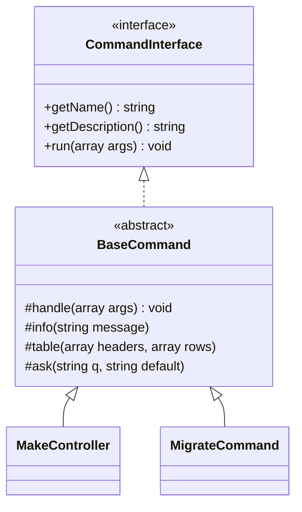

# 🖥️ Console Engine (BaseCommand & Commands)

The Framework menyediakan **Console Engine** yang sangat powerful dan berestetika tinggi. Dokumentasi ini merincikan arsitektur internal Artisan CLI, cara sistem mendeteksi perintah secara otomatis, dan referensi implementasi untuk 41 perintah bawaan.

---

## 📋 Daftar Isi

1. [Arsitektur Command](#arsitektur-command)
2. [Auto-Discovery System](#auto-discovery-system-) — **PREMIUM**
3. [Hybrid Command Discovery](#hybrid-command-discovery-) — **NEW (v5.0.1)**
4. [Premium Output Styling](#premium-output-styling)
5. [User Interaction (STDIN)](#user-interaction-stdin)
6. [Sistem Stubs (Templating)](#sistem-stubs-templating)
7. [Referensi 43 Commands](#referensi-43-commands)

---

## Arsitektur Command

Semua perintah Artisan beroperasi di bawah kontrak `CommandInterface` dan mayoritas meng-extend `BaseCommand`.



### CommandInterface

Jika Anda ingin membuat perintah yang sangat ringan tanpa _overhead_ dari `BaseCommand`, cukup implementasikan interface berikut:

```php
namespace TheFramework\Console;

interface CommandInterface {
    public function getName(): string;
    public function getDescription(): string;
    public function run(array $args): void;
}
```

---

## Auto-Discovery System 🚀

Artisan CLI menggunakan **Dynamic Command Loader**. Setiap file `.php` yang diletakkan di dalam folder `app/Console/Commands/` akan otomatis dideteksi dan didaftarkan sebagai perintah aktif, asalkan class tersebut mengimplementasikan `CommandInterface`.

### Levenshtein Suggestion

Jika terjadi kesalahan pengetikan (_typo_) saat menjalankan perintah, Artisan akan secara cerdas memberikan saran:

```bash
$ php artisan make:controler
✖ ERROR  Perintah [make:controler] tidak ditemukan.
Mungkin maksud Anda: make:controller
```

---

## Hybrid Command Discovery 🔌 

Mulai **v5.0.1**, The Framework dilengkapi dengan `LaravelCommandAdapter` dan `HybridCommandScanner`. 
Sistem ini memungkinkan Artisan untuk **memindai folder `vendor/`** dan secara otomatis mendaftarkan native Symfony/Laravel commands yang dibawa oleh *package* pihak ketiga.

- **Lazy Loading**: Command eksternal dibalut oleh Adapter ini, dan dependensinya baru di-*instantiate* secara tepat waktu (*Just-in-Time*) saat dipanggil. Hal ini mencegah *Fatal Error* akibat *heavy bindings*.
- **Seamless Integration**: Perintah eksternal dapat dijalankan persis sama seperti perintah bawaan, lengkap dengan argumen dan flag-nya.

---

## Premium Output Styling

`BaseCommand` menyediakan helper output dengan label berlatar belakang warna (_background labels_) untuk memberikan kesan profesional pada terminal.

### 1. Labeled Status

```php
$this->info('Database connected');      // 🔵 [ INFO ] Cerah
$this->success('Project created');      // 🟢 [ SUCCESS ] Hitam di atas Hijau
$this->warn('Environment missing');     // 🟡 [ WARN ] Hitam di atas Kuning
$this->error('Access Denied');          // 🔴 [ ERROR ] Putih di atas Merah
```

### 2. Premium Tables (Unicode Box-Drawing)

Framework menggunakan karakter Unicode tingkat lanjut untuk merender tabel yang rapi dan presisi di terminal manapun.

```php
$this->table(
    ['ID', 'Name', 'Status'],
    [
        [1, 'Jhon', 'Active'],
        [2, 'Doe', 'Pending'],
    ]
);
```

**Output:**

```text
┌────┬─────────┬─────────┐
│ ID │ Name    │ Status  │
├────┼─────────┼─────────┤
│ 1  │ Jhon    │ Active  │
│ 2  │ Doe     │ Pending │
└────┴─────────┴─────────┘
```

---

## User Interaction (STDIN)

### Ask (Input dengan Default)

```php
$port = $this->ask('Pilih port server', '8080');
// Jika user hanya menekan Enter, $port akan bernilai "8080"
```

### Confirm (Y/N)

```php
if ($this->confirm('Apakah Anda yakin ingin menghapus tabel?', false)) {
    // User menjawab 'y' atau 'yes'
}
```

---

## Sistem Stubs (Templating)

Commands generator seperti `make:*` menggunakan file template yang disebut **Stubs** di `app/Console/Stubs/`. Anda dapat memodifikasi stub ini untuk mengubah pola kode yang dihasilkan.

### Placeholder Standar (v5.1.0)

| Placeholder     | Deskripsi                 | Contoh                          |
| --------------- | ------------------------- | ------------------------------- |
| `{{namespace}}` | Namespace lengkap         | `TheFramework\Http\Controllers` |
| `{{class}}`     | Nama class (StudlyCase)   | `UserController`                |
| `{{model}}`     | Nama model terkait        | `User`                          |
| `{{table}}`     | Nama tabel (Plural/Snake) | `users`                         |
| `{{view_path}}` | Dot-notation view         | `admin.user`                    |

### Contoh Implementasi di Command:

```php
$content = file_get_contents($stubPath);
$final = str_replace(['{{class}}', '{{namespace}}'], [$className, $namespace], $content);
file_put_contents($targetFile, $final);
```

---

## Referensi 43 Commands

### 🚀 Application & Performance

| Command          | Deskripsi                                 |
| ---------------- | ----------------------------------------- |
| `setup`          | Inisialisasi awal (App Key, .env, Folder) |
| `serve`          | Development server (Auto-IP Detection)    |
| `optimize`       | Cache config, routes, dan views           |
| `optimize:clear` | Bersihkan seluruh cache framework         |
| `tinker`         | Interactive REPL (PHP Shell)              |
| `down` / `up`    | Kontrol Maintenance Mode                  |

### 📦 Generators (`make:*`)

| Command            | Output                                                                                                |
| ------------------ | ----------------------------------------------------------------------------------------------------- |
| `make:crud [Name]` | **Premium Scaffolder**: generates Model, Controller, Service, Repository, Request, 4 Views, & Routes. |
| `make:controller`  | Controller (opsi `-r` untuk Resource)                                                                 |
| `make:model`       | Model (opsi `-m` untuk Migration)                                                                     |
| `make:migration`   | Database Migration dengan timestamp                                                                   |
| `make:service`     | Service Layer class                                                                                   |
| `make:repository`  | Repository Pattern class                                                                              |
| `make:request`     | Form Request Validation class                                                                         |
| `make:command`     | Perintah Artisan baru (Stub Based)                                                                    |
| `make:component`   | Komponen TFWire + View                                                                                |
| `make:test`        | Feature atau Unit Test baru                                                                           |
| ...                | (Total 18 generator commands)                                                                         |

### 🗄️ Database

| Command            | Deskripsi                                 |
| ------------------ | ----------------------------------------- |
| `migrate`          | Jalankan migrasi baru                     |
| `migrate:rollback` | Kembalikan status ke batch sebelumnya     |
| `migrate:fresh`    | Drop semua tabel & jalankan ulang migrasi |
| `migrate:status`   | Cek riwayat migrasi yang sudah jalan      |
| `db:seed`          | Isi database dengan data dummy            |

---

<div align="center">

[Back to Documentation](README.md) • [Main README](../README.md)

</div>
