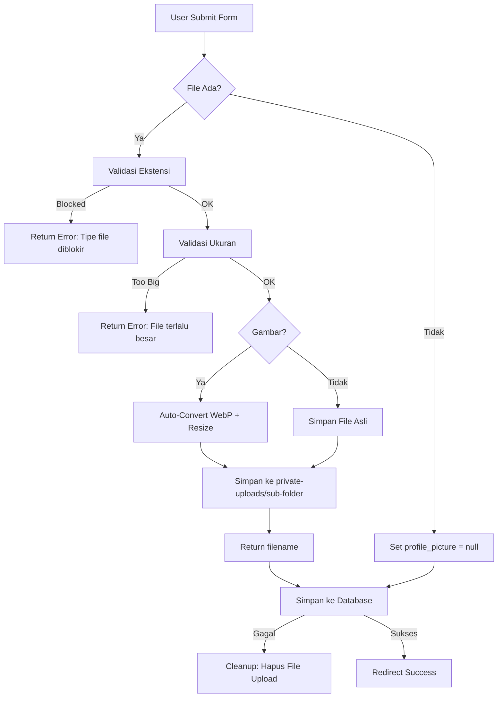

# 📤 File Upload & Private Storage (v5.0.1)

Panduan lengkap sistem upload file di The Framework.  
File disimpan di folder **`private-uploads/`** yang berada **di luar public root** — tidak bisa diakses langsung via URL, sehingga **aman dari direct download**.

---

## 📁 Struktur Folder

```
FRAMEWORK/
├── private-uploads/         ← 🔒 File upload tersimpan di sini (aman!)
│   ├── .htaccess            ← Block akses langsung (403 Forbidden)
│   ├── user-pictures/       ← Foto profil user (auto-convert WebP)
│   ├── shared/              ← File bersama
│   └── dummy/               ← File dummy/testing
├── public/                  ← Folder publik (bisa diakses via URL)
│   └── assets/              ← CSS, JS, gambar statis
└── storage/                 ← Cache, logs, session (internal)
```

### 🔒 Kenapa `private-uploads` Bukan `public/uploads`?

| Aspek              | `public/uploads` ❌         | `private-uploads/` ✅        |
| :----------------- | :-------------------------- | :--------------------------- |
| **Akses langsung** | Siapapun bisa akses via URL | Hanya bisa via route + auth  |
| **Keamanan**       | File PHP bisa di-eksekusi   | Dilindungi `.htaccess`       |
| **Kontrol**        | Tidak ada otorisasi         | Bisa cek permission per user |
| **SEO**            | Bisa di-index Google        | Tidak bisa di-crawl          |

---

## ⚙️ Konfigurasi (.env)

```env
# 📤  FILE UPLOAD
# Direktori upload default (di luar public root = aman)
UPLOAD_DIR=/private-uploads

# Ukuran maksimum file dalam KB (10240 = 10MB)
UPLOAD_MAX_SIZE=10240

# Auto-convert gambar ke WebP?
UPLOAD_AUTO_WEBP=true

# Kualitas konversi WebP (1-100)
UPLOAD_WEBP_QUALITY=80
```

Config file: `config/upload.php`

```php
return [
    'default_dir'  => $_ENV['UPLOAD_DIR'] ?? '/private-uploads',
    'max_size'     => (int) ($_ENV['UPLOAD_MAX_SIZE'] ?? 10240) * 1024,
    'auto_webp'    => filter_var($_ENV['UPLOAD_AUTO_WEBP'] ?? true, FILTER_VALIDATE_BOOLEAN),
    'webp_quality' => (int) ($_ENV['UPLOAD_WEBP_QUALITY'] ?? 80),
    'allowed_categories' => [
        'images'    => ['jpg', 'jpeg', 'png', 'webp', 'gif', 'svg'],
        'documents' => ['pdf', 'doc', 'docx', 'xls', 'xlsx', ...],
        'archives'  => ['zip', 'rar', '7z', 'tar', 'gz'],
        'videos'    => ['mp4', 'avi', 'mov', 'wmv', 'flv', 'webm'],
        'audio'     => ['mp3', 'wav', 'ogg', 'm4a', 'aac'],
    ],
];
```

---

## 🏗️ Arsitektur (Clean Architecture)

```
┌──────────────┐     ┌──────────────┐     ┌──────────────────┐     ┌──────────┐
│  Controller  │ ──▶ │   Service    │ ──▶ │   Repository     │ ──▶ │  Model   │
│  (HTTP I/O)  │     │ (Business    │     │ (Data Access     │     │ (DB)     │
│              │     │  Logic +     │     │  Layer)          │     │          │
│              │     │  Upload)     │     │                  │     │          │
└──────────────┘     └──────────────┘     └──────────────────┘     └──────────┘
       │                    │
       │                    ▼
       │            ┌───────────────┐
       └──────────▶ │ UploadHandler │
                    │ (File Engine) │
                    └───────────────┘
```

| Layer          | File                 | Tanggung Jawab                                |
| :------------- | :------------------- | :-------------------------------------------- |
| **Controller** | `HomeController.php` | Mengatur alur request/response                |
| **Service**    | `UserService.php`    | Business logic + upload + cleanup             |
| **Repository** | `UserRepository.php` | Query database (find, create, update, delete) |
| **Model**      | `User.php`           | Definisi tabel & kolom                        |
| **Handler**    | `UploadHandler.php`  | Upload, konversi, hapus file                  |
| **Request**    | `UserRequest.php`    | Validasi input form                           |

---

## 📤 UploadHandler API

### Static Methods (untuk Controller/Service)

```php
use TheFramework\Handlers\UploadHandler;

// 1. Upload + auto-convert ke WebP
$result = UploadHandler::handleUploadToWebP(
    $_FILES['photo'],        // File dari form
    '/user-pictures',        // Sub-folder di private-uploads
    'foto_',                 // Prefix nama file
    80                       // Kualitas WebP (opsional)
);

// 2. Upload biasa (tanpa konversi)
$result = UploadHandler::handleUpload(
    $_FILES['document'],
    '/documents',
    'doc_'
);

// 3. Cek apakah error
if (UploadHandler::isError($result)) {
    echo UploadHandler::getErrorMessage($result);
    // "Ukuran file melebihi batas maksimum (10MB)."
}

// 4. Hapus file
UploadHandler::delete('foto_20260226_123456_a1b2c3d4.webp', '/user-pictures');

// 5. Cek file ada
UploadHandler::exists('foto_xxx.webp', '/user-pictures'); // true/false

// 6. Dapatkan path lengkap
UploadHandler::path('foto_xxx.webp', '/user-pictures');
// → C:\...\FRAMEWORK\private-uploads\user-pictures\foto_xxx.webp

// 7. Dapatkan URL serve (via route)
UploadHandler::url('foto_xxx.webp', '/user-pictures');
// → http://localhost:8080/file/user-pictures/foto_xxx.webp
```

> **Note:** Karena file disimpan di luar folder publik, URL ini akan memicu `FileController` untuk memvalidasi akses sebelum menyajikan file ke browser.

### Instance Methods (core engine)

```php
$handler = new UploadHandler();

$result = $handler->save($_FILES['photo'], '/user-pictures', [
    'prefix'     => 'foto_',
    'convert_to' => 'webp',   // Auto-convert ke WebP
    'quality'    => 85,        // Kualitas WebP
    'width'      => 800,       // Resize ke 800px lebar
    'maxSize'    => 5242880,   // Override max size (5MB)
]);

// Result:
// [
//     'name'      => 'foto_20260226_123456_a1b2c3d4.webp',
//     'path'      => '/user-pictures/foto_20260226_123456_a1b2c3d4.webp',
//     'full_path' => 'C:\...\private-uploads\user-pictures\foto_xxx.webp',
//     'type'      => 'image/webp',
//     'success'   => true,
// ]
```

---

## 🔧 Contoh Implementasi Lengkap

### 1. UserRequest (Validasi)

```php
// app/Http/Requests/UserRequest.php
class UserRequest extends Request
{
    public function rules(): array
    {
        return [
            'name'            => 'required|min:3|max:100',
            'email'           => 'required|email',
            'profile_picture' => 'nullable|file|mimes:jpeg,png,jpg|max:2048',
        ];
    }
}
```

### 2. UserRepository (Data Access)

```php
// app/Repositories/UserRepository.php
class UserRepository
{
    public function isNameTaken(string $name, ?string $excludeUid = null): bool
    {
        $query = $this->model->query()->where('name', '=', $name);
        if ($excludeUid) {
            $query->where('uid', '!=', $excludeUid);
        }
        return (bool) $query->first();
    }

    public function create(array $data): bool { ... }
    public function update(array $data, string $uid): bool { ... }
    public function delete(string $uid): bool { ... }
}
```

### 3. UserService (Business Logic + Upload)

```php
// app/Services/UserService.php
class UserService
{
    protected UserRepository $repo;

    public function createFromRequest(UserRequest $request)
    {
        $validated = $request->validated();

        // 1. Check uniqueness via Repository
        if ($this->repo->isNameTaken($validated['name'])) {
            return 'name_exist';
        }

        // 2. Handle upload
        if ($request->hasFile('profile_picture')) {
            $uploadResult = UploadHandler::handleUploadToWebP(
                $request->file('profile_picture'),
                '/user-pictures',
                'foto_'
            );
            if (UploadHandler::isError($uploadResult)) return $uploadResult;
            $validated['profile_picture'] = $uploadResult;
        }

        // 3. Generate UID + insert via Repository
        $validated['uid'] = Helper::uuid();
        return $this->repo->create($validated);
    }
}
```

### 4. HomeController (HTTP Layer)

```php
// app/Http/Controllers/HomeController.php
class HomeController extends Controller
{
    public function CreateUser()
    {
        $request = new UserRequest();
        $result = $this->userService->createFromRequest($request);

        if (UploadHandler::isError($result)) {
            return redirect('/users', 'error', 'Upload gagal: ' . UploadHandler::getErrorMessage($result));
        }
        if (is_string($result)) {
            return redirect('/users', 'error', self::CREATE_ERRORS[$result]);
        }

        return redirect('/users', 'success', 'User berhasil dibuat');
    }
}
```

---

## 🛡️ Keamanan Upload

### Ekstensi yang Diblokir Otomatis

```
php, phtml, phar, exe, sh, bat, cmd, com, vbs, js, htaccess
```

### Error Messages (Bahasa Indonesia)

| Error Code              | Pesan                                                       |
| :---------------------- | :---------------------------------------------------------- |
| `UPLOAD_ERR_INI_SIZE`   | Ukuran file melebihi batas `upload_max_filesize` di php.ini |
| `UPLOAD_ERR_FORM_SIZE`  | Ukuran file melebihi batas `MAX_FILE_SIZE` di form          |
| `UPLOAD_ERR_PARTIAL`    | File hanya ter-upload sebagian                              |
| `UPLOAD_ERR_NO_FILE`    | Tidak ada file yang di-upload                               |
| `UPLOAD_ERR_NO_TMP_DIR` | Folder temporary tidak ditemukan                            |
| `UPLOAD_ERR_CANT_WRITE` | Gagal menulis file ke disk                                  |
| `UPLOAD_ERR_EXTENSION`  | Upload dihentikan oleh ekstensi PHP                         |

### Nama File Aman

Format: `{prefix}{tanggal}_{jam}_{random_hex}.{ext}`

Contoh: `foto_20260226_183045_a1b2c3d4.webp`

- ✅ Tidak ada karakter spesial
- ✅ Tidak ada nama asli file (mencegah path traversal)
- ✅ Random hex mencegah nama bentrok
- ✅ Timestamp untuk sorting/audit

---

## 📋 Form HTML (Blade Template)

```html
<form action="/users/create" method="POST" enctype="multipart/form-data">
  @csrf

  <input type="text" name="name" value="{{ old('name') }}" placeholder="Nama" />
  @error('name')
  <span class="error">{{ $message }}</span>
  @enderror

  <input
    type="email"
    name="email"
    value="{{ old('email') }}"
    placeholder="Email"
  />

  <input
    type="file"
    name="profile_picture"
    accept="image/jpeg,image/png,image/jpg"
  />
  @error('profile_picture')
  <span class="error">{{ $message }}</span>
  @enderror

  <button type="submit">Simpan</button>
</form>
```

---

## 🔄 Flow Diagram: Upload Process



---

## ✅ Best Practices

### DO's ✅

1. Selalu simpan file di **`private-uploads/`** (bukan public)
2. Gunakan **`UploadHandler::handleUploadToWebP()`** untuk gambar
3. Selalu cek **`UploadHandler::isError()`** setelah upload
4. Cleanup file jika operasi database gagal
5. Validasi tipe file di **Request** (`mimes:jpeg,png,jpg`)
6. Gunakan **Service** untuk business logic, bukan Controller

### DON'Ts ❌

1. ❌ Jangan simpan file ke `public/`
2. ❌ Jangan pakai nama file asli dari user
3. ❌ Jangan skip validasi ekstensi
4. ❌ Jangan akses Repository langsung dari Controller

---

<div align="center">

**Upload Engine v5.0.1 — Secure by Default** 🔒

[Back to Documentation](README.md) • [Main README](../README.md)

</div>
